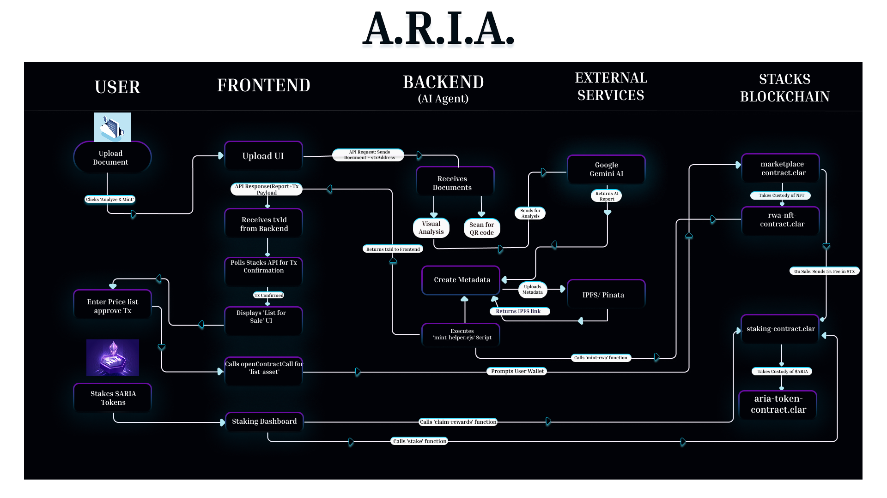
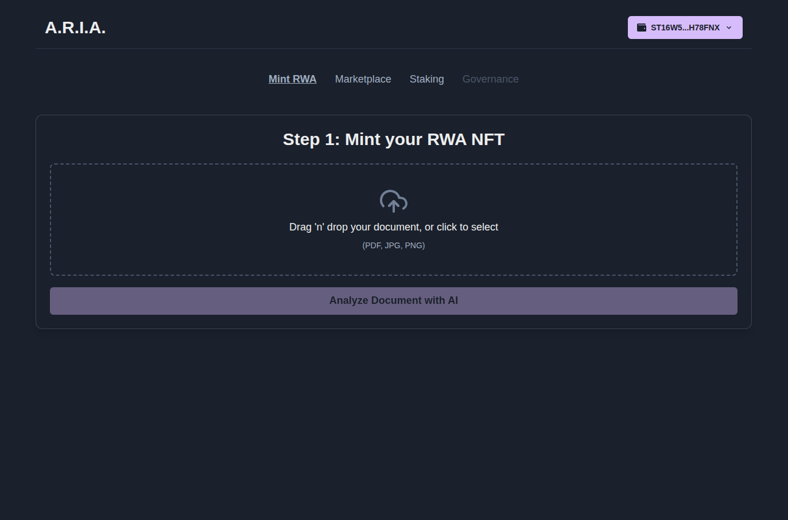
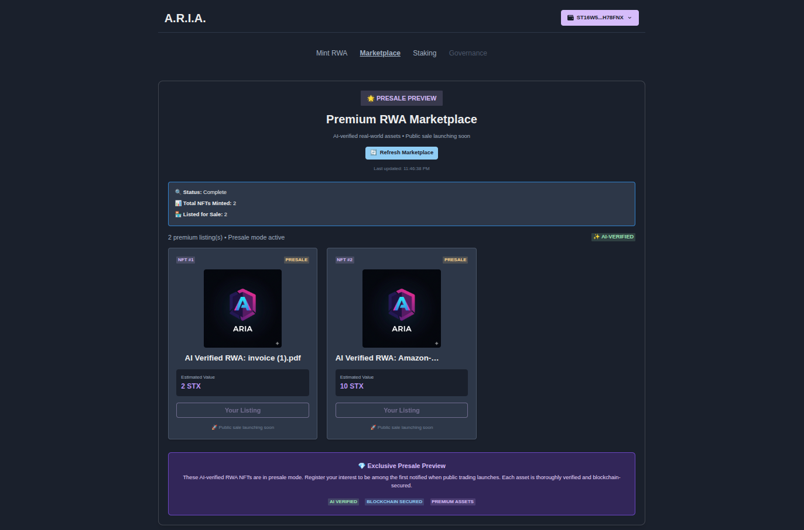
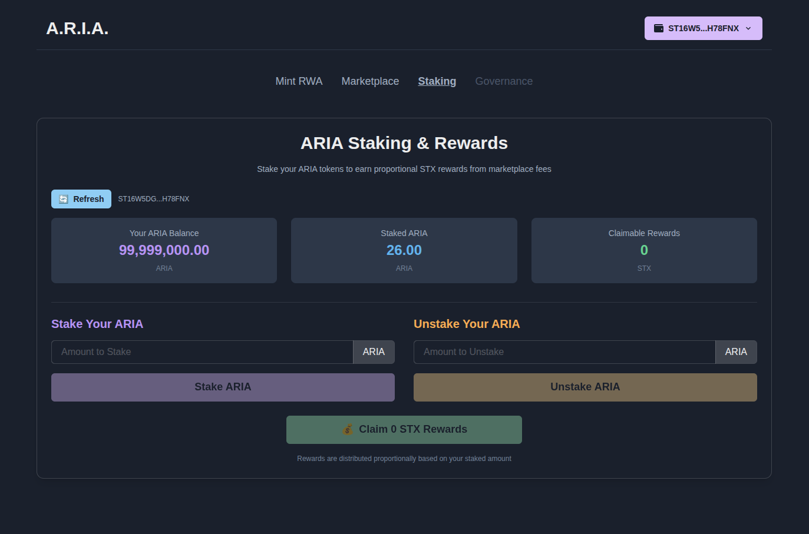

# A.R.I.A. - Automated RWA Intelligence & Authentication

<p align="center">
  <strong>A complete protocol to verify, mint, and trade Real-World Assets as liquid, on-chain NFTs on the Stacks blockchain.</strong>
</p>

<p align="center">
  <a href="https://aria-on-stacks.vercel.app/" target="_blank">
    
  </a>
  <a href="https://youtu.be/m-Y3aGPawJY" target="_blank">
    
  </a>
</p>

---

## 🎯 The Problem & Our Solution

Tokenizing Real-World Assets (RWAs) is crippled by a fundamental bottleneck: **trust and liquidity**. Manual verification is slow and expensive, and even tokenized assets have no native venue to be traded.

**A.R.I.A. (Automated RWA Intelligence & Authentication)** solves this by creating a trustless, end-to-end ecosystem built on the Stacks blockchain. We have built a complete, self-sustaining protocol that handles the entire lifecycle of a Real-World Asset.

Our "document-to-DeFi" lifecycle is live and fully automated:

1. **AI-Powered Verification:** A custom AI Agent uses **Google Gemini** for deep data analysis and **QR Code Cross-Verification** to provide two-factor proof of authenticity.
2. **On-Chain Integrity:** The AI's full verification report is formatted into rich metadata and permanently pinned to **IPFS**.
3. **Permissioned Minting:** Our backend service, acting as the sole trusted minter, programmatically calls our **SIP-009 RWA NFT** contract to mint a "Verified RWA" NFT directly to the user's wallet.
4. **Presale Preview & Trade:** Users can list their verified NFTs on our custom **Marketplace Contract**. The marketplace currently operates in presale mode, allowing early adopters to register interest in premium assets before public trading launches.
5. **Community-Owned Yield:** When public trading activates, the contract will automatically route a 5% platform fee to our **Staking Contract**, where holders of the native **SIP-010 $ARIA** token can stake to earn a proportional share of all platform revenue in STX.

---

## 🗺️ Architecture on Stacks

Our architecture is a seamless integration of off-chain AI processing with on-chain, composable Clarity smart contracts. The Python backend acts as a trusted oracle, performing verification and executing the permissioned `mint-rwa` function on the RWA NFT contract. From that point on, all user interactions—listing, browsing, and (post-presale) purchasing—are direct, trustless transactions with the Clarity contracts.



---

## 📸 Application Screenshots

<p align="center">
  
  <br>
  <em>AI-Powered Verification & Minting Dashboard</em>
</p>

<p align="center">
  
  <br>
  <em>Presale Marketplace - Browse & Register Interest</em>
</p>

<p align="center">
  
  <br>
  <em>Staking Dashboard - Earn STX Rewards</em>
</p>

---

## ✨ Key Features

We delivered a feature-rich MVP that showcases a truly investable and self-sustaining protocol.

* ✅ **Premium Marketplace with Presale Mode:** A fully on-chain venue for users to list and browse verified RWA NFTs. Currently in presale mode to build demand before public trading launch.
* ✅ **Complete Economic Loop:** An end-to-end business model where marketplace fees will be automatically routed to the staking contract to be distributed as real yield (STX) to $ARIA token stakers.
* ✅ **Deep AI Integration:** Multi-factor verification using Gemini Vision and on-document QR code validation, presented in a polished "AI Report Card".
* ✅ **Modern UX/UI:** A custom dark theme, a modern header, toast notifications, and integration with the **Leather Wallet** for a smooth user experience.
* ✅ **Comprehensive Dashboards:** Includes a full-featured "Staking Dashboard" and the "Marketplace."
* ✅ **Transparent Backend Interaction:** The frontend provides real-time polling and feedback as the backend mints the NFT, giving users a clear view into the on-chain confirmation process.
* ✅ **Unified Smart Contract:** NFT minting and marketplace operations are now consolidated into a single, gas-efficient contract, reducing complexity and improving composability.

---

## 🛠️ Technology Stack

* **Frontend:** React, Vite, **@stacks/transactions**, Chakra UI, **Leather Wallet**
* **Backend:** Python, Flask, **Node.js (for minting helper)**
* **AI:** Google Gemini Pro Vision API
* **Blockchain:** **Stacks Testnet**, **Clarity**
* **Smart Contracts:** **SIP-009** (RWA NFT), **SIP-010** (ARIA Token), Unified Marketplace & NFT Contract, Staking Contract
* **Decentralized Storage:** IPFS (via Pinata)

---

## 🚀 Getting Started

### Live Demo (Recommended)

**Live Application URL:** **[YOUR_VERCEL_OR_NETLIFY_URL]**

**User Journey:**

1. Connect your **Leather Wallet** (set to Testnet).
2. Go to the **"Mint RWA"** page to upload a document. The backend will verify it and mint the NFT to your wallet.
3. Wait for the transaction to confirm. The UI will update automatically.
4. List your newly minted NFT on the marketplace.
5. Navigate to the **"Marketplace"** page to browse premium assets and register interest during presale.
6. Visit the **"Staking"** page to stake your `$ARIA` tokens and prepare to earn platform fees in STX when public trading launches.

### Running Locally

1. **Clone the Repository:**

    ```sh
    git clone https://github.com/Nihal-Pandey-2302/ARIA-ON-STACKS.git
    cd your-repo-name
    ```

2. **Setup & Run Backend:**

    ```sh
    cd aria-backend
    
    # Setup Python environment
    python3 -m venv venv
    source venv/bin/activate
    pip install -r requirements.txt
    
    # Setup Node.js helper environment
    npm install
    
    # Create a .env file with your API keys and the contract owner's secret key
    # See .env.example
    
    # Run the Flask server
    python app.py
    ```

3. **Setup & Run Frontend:**

    ```sh
    cd ../aria-frontend
    npm install
    npm run dev
    ```

---

## 🔗 Deployed Contracts (Testnet)

### Current Deployment

* **Deployer Address:** `ST16W5DG0N8VP85W6DK1ZB4ME3BK3WN2750H78FNX`
* **$ARIA Token (SIP-010):** `ST16W5DG0N8VP85W6DK1ZB4ME3BK3WN2750H78FNX.aria-token-v2`
* **Unified RWA NFT & Marketplace (SIP-009):** `ST16W5DG0N8VP85W6DK1ZB4ME3BK3WN2750H78FNX.rwa-nft-marketplace-unified`
* **Staking Contract:** `ST16W5DG0N8VP85W6DK1ZB4ME3BK3WN2750H78FNX.staking-contract-v7`

**Contract Architecture Improvement:**
In this iteration, we consolidated NFT minting and marketplace operations into a single unified contract (`rwa-nft-marketplace-unified`), reducing contract complexity, improving gas efficiency, and simplifying state management while maintaining full functionality and security.

---

## 📋 Legacy Contracts (Previous Deployment)

The following contracts represent our original architecture, where NFT and marketplace functions were separated into distinct contracts. These are preserved for reference and are no longer actively maintained:

* **RWA NFT (SIP-009) - Legacy:** `ST16W5DG0N8VP85W6DK1ZB4ME3BK3WN2750H78FNX.rwa-nft-contract`
* **Marketplace Contract - Legacy:** `ST16W5DG0N8VP85W6DK1ZB4ME3BK3WN2750H78FNX.marketplace-contract`
* **$ARIA Token (SIP-010) - Legacy:** `ST16W5DG0N8VP85W6DK1ZB4ME3BK3WN2750H78FNX.aria-token-contract`
* **Staking Contract - Legacy:** `ST16W5DG0N8VP85W6DK1ZB4ME3BK3WN2750H78FNX.staking-contract`

**Migration Notes:**
Users who previously interacted with the legacy contracts are encouraged to migrate to the current unified deployment for improved performance and access to the latest features. The unified contract maintains backward compatibility with key function signatures while offering enhanced optimization.

---

## 🔮 Future Vision

* **Public Trading Launch:** Activate full peer-to-peer trading functionality on the marketplace with automated fee distribution to stakers.
* **Fractionalization:** Allow users to fractionalize high-value RWAs into fungible SIP-010 tokens.
* **DeFi Collateralization:** Partner with lending protocols on Stacks to allow A.R.I.A.'s AI-verified NFTs to be used as trusted collateral.
* **Full DAO Governance:** Transition ownership of key protocol contracts to a DAO controlled by staked $ARIA holders.
* **Cross-Chain Bridging:** Enable RWA NFTs to be bridged to other blockchains for increased liquidity and reach.

---

## 👨‍💻 Author

* **Nihal Pandey**
* **[GitHub](https://github.com/Nihal-Pandey-2302)** | **[LinkedIn](https://www.linkedin.com/in/nihal-pandey-8529b6257/)** | **[X (Twitter)](https://x.com/PandeyNihal23)**
